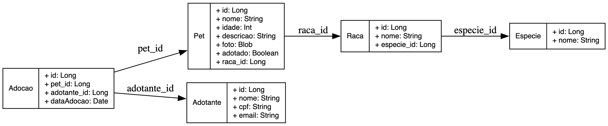

# PetAdota

## Autores

 - IGOR JOSAFA TORRES BARBOSA – RA: 72300095

 - KAYO EMANOEL ROCHA MACHADO - RA: 72300258

 - LUIZA EDUARDA AMARO DIAS - RA: 72300995

 - VALÉRIA DOS SANTOS RODRIGUES - RA: 72300369

---

## Repositório

O projeto se encontra hospedado no repositório [https://github.com/igorjosafa/PetAdota.git](https://github.com/igorjosafa/PetAdota.git), o qual contém o código do sistema e um arquivo README.md contendo as informações pertinentes deste projeto.

---

## Descrição do Projeto

**PetAdota** é um sistema web desenvolvido para apoiar a missão da ONG de mesmo nome, cuja proposta é facilitar a adoção de animais abandonados por meio da conexão entre abrigos e potenciais adotantes.

O sistema permite que abrigos cadastrem, atualizem, removam e listem pets disponíveis para adoção, e que usuários interessados visualizem esses pets por meio de uma **interface web** e/ou de uma **API RESTful**.

---

## Tecnologias Utilizadas

- Java 17
- Spring Boot
- Thymeleaf
- H2 Database (em memória)
- HTML + Bootstrap
- API RESTful

---

## Como Rodar Localmente

### Requisitos

- Java 17+
- Maven 3.8+
- Git

#### Clonando o projeto

```bash
git clone https://github.com/igorjosafa/petadota.git
cd petadota
```

### Rodando com Maven

```bash
./mvnw spring-boot:run
```

Ou (em sistemas Windows):

```bash
mvnw.cmd spring-boot:run
```

Acesse: [http://localhost:8080](http://localhost:8080)

### Banco de dados

Acesso ao banco de dados: [http://localhost:8080/h2-console/](http://localhost:8080/h2-console/)

JDBC UR: jdbc:h2:~/devdb

Usuário: sa

A senha não é necessária.

---

## Diagrama DER do projeto



---

## Instruções de Uso

Você pode interagir com o sistema de duas formas:

- Via **interface web**, acessando páginas renderizadas com Thymeleaf.
- Via **API RESTful**, consumida por sistemas externos ou ferramentas como Postman, Insomnia ou cURL.

---

## Interface Web

### Acesso

Após rodar o projeto, abra seu navegador e acesse:

```
http://localhost:8080
```

### Funcionalidades Disponíveis

#### 1. Pets

- **Listagem de pets:** Página principal exibe todos os pets cadastrados, indicando se estão disponíveis para adoção.
- **Detalhes de um pet:** Clique em "Detalhes".
- **Cadastro de novo pet:** Clique em “Adicionar Pet”, preencha nome, raça, idade, descrição e anexe uma foto.
- **Edição de pet:** A partir da lista de pets, clique em editar, edite os campos desejados e salve.
- **Exclusão de pet:** Clique em "deletar" e confirme a remoção.

#### 2. Raças e Espécies

- Cadastro, listagem e exclusão de **raças** e **espécies** em:
  - `/racas`
  - `/especies`

**Espécies com raças associadas não podem ser excluídas.**

#### 3. Adotantes

- Os dados dos adotantes e potenciais adotantes podem ser criados, listados e excluídos em `/adotantes`.

**Adotantes cujos pets adotados possuam registro no sistema não podem ser excluídos.**

#### 4. Adoções

- As adoções são cadastradas em `/adocoes`.

**Se uma adoção é excluída, o pet volta a ficar sinalizado como disponível para adoção.**


---

## API RESTful

### Base URL

```
http://localhost:8080/api
```

### 1. Endpoints de Pets

#### Listar todos os pets

```http
GET /api/pets/
```

#### Listar apenas pets disponíveis para adoção

```http
GET /api/pets/disponiveis/
```

#### Buscar pet por ID

```http
GET /api/pets/{id}/
```

#### Cadastrar novo pet

```http
POST /api/pets
Content-Type: multipart/form-data
```

**Parâmetros esperados:**
- `nome`: String
- `idade`: int
- `racaId`: Long
- `descricao`: String
- `foto`: MultipartFile

#### Atualizar pet existente

```http
PUT /api/pets/{id}
Content-Type: multipart/form-data
```

**Parâmetros opcionais:**
- `nome`, `idade`, `racaId`, `descricao`, `foto`

#### Remover pet

```http
DELETE /api/pets/{id}
```

---

### 2. Endpoints de Raças

```http
GET    /api/racas/
GET    /api/racas/{id}
DELETE /api/racas/{id}
````

```http
POST /api/racas
Content-Type: multipart/form-data
```

**Parâmetros esperados:**
- `nome`: String
- `especieId`: Long

```http
PUT    /api/racas/{id}
Content-Type: multipart/form-data
```

**Parâmetros opcionais:**
- `nome`, `especieId`

**DELETE retorna erro 409 (Conflict) se houver pets associadas à raça.**

---

### 3. Endpoints de Espécies

```http
GET    /api/especies/
GET    /api/especies/{id}
DELETE /api/especies/{id}
```

```http
POST /api/especies
Content-Type: multipart/form-data
```

**Parâmetros esperados:**
- `nome`: String

```http
PUT    /api/especies/{id}
Content-Type: multipart/form-data
```

**Parâmetros opcionais:**
- `nome`

**DELETE retorna erro 409 (Conflict) se houver raças associadas à espécie.**

---

### 4. Endpoints de Adotantes

```http
GET    /api/adotantes/
GET    /api/adotantes/{id}
DELETE /api/adotantes/{id}
```

```http
POST /api/adotantes
Content-Type: multipart/form-data
```

**Parâmetros esperados:**
- `nome`: String
- `cpf`: String
- `email`: String

```http
PUT    /api/adotantes/{id}
Content-Type: multipart/form-data
```

**Parâmetros opcionais:**
- `nome`, `cpf`, `email`

**DELETE retorna erro 409 (Conflict) se houver adoções associadas ao adotante.**

---

### 5. Endpoints de Adoções

```http
GET    /api/adocoes/
GET    /api/adocoes/{id}
DELETE /api/adocoes/{id}
```

```http
POST /api/adocoes
Content-Type: multipart/form-data
```

**Parâmetros esperados:**
- `petId`: Long
- `adotanteId`: Long

**DELETE faz com que a adoção seja invalidada e o pet volte a ficar disponível para novas adoções.**

---

## Estrutura do Projeto

- `model/`: Entidades JPA (Pet, Raca, Especie, Adotante e Adocao)
- `repository/`: Interfaces JPA para persistência
- `controller/`: Controllers web (Thymeleaf) e REST
- `service/`: Services para controlar ações mais complexas
- `templates/`: Views HTML com Thymeleaf
- `static/`: Imagens de exemplo

---


## Exemplos de Tela

Abaixo alguns exemplos de telas da aplicação disponíveis na pasta `static/img/`:

### Página Inicial


### Detalhes dos Pets


### Adoções Cadastradas


